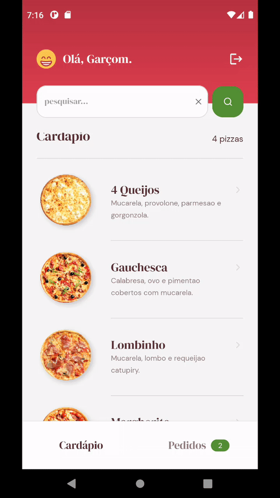

<h1 align="center">🍕 Go Pizza</h1>

<p align="center">
  

  

  <a href="https://github.com/paulocf92/gopizza/commits/main">
    
  </a>

  
   <a href="https://github.com/paulocf92/gopizza/stargazers">
    
  </a>
</p>

Manage your pizzas and deliver them in the snap of a finger!

<p align="center"></p>

# 🚀 About the project

**Go Pizza** is a study app that offers basic CRUD operations for a pizza delivery solution. This app is powered by Firebase with authentication, realtime database (Firestore) and file storage.

Main technologies used:

- ⭐ React Native
- ⭐ Firebase (BaaS)
  - Firestore
  - Storage
  - Authentication

Additional libs:

- Styled Components

# ⚙️ Installing and Running

Install dependencies, make sure Firebase is correctly set up for the project and start React Native environment.

```bash
# install dependencies
$ yarn install

# set up your app to work with firebase's firestore, storage and authentication

# run react native bundler
$ yarn start

# run app on the device
$ yarn android
# or
$ yarn ios
```

## 📝 License

This project is under MIT license.

Made with ❤️ by [Paulo Filho](https://www.linkedin.com/in/paulocf92/)! 😊